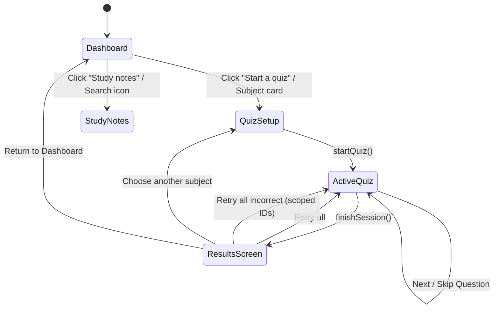

# AGENTS.md — Developer & AI Agent Guidelines

> Operational handbook and architectural rules for AI coding assistants and developers maintaining **lock tf in — Reviewer**.

---

## 1. Prime Directives & Constraints

1. **HTML Inviolability**:
   - **DO NOT modify [index.html](file:///c:/Users/raisi/Documents/Coding%20Projects/lock-tf-in/index.html)** unless explicitly commanded by the user. All visual components, dynamic views, and widgets are injected or toggled through [script.js](file:///c:/Users/raisi/Documents/Coding%20Projects/lock-tf-in/script.js) using established DOM hooks.
2. **Zero-Build Vanilla Architecture**:
   - Keep the project pure Vanilla HTML5, CSS3, and modern ECMAScript.
   - Do NOT introduce build tools, transpilers, npm packages, or bundlers (Vite, Webpack, Tailwind, TypeScript) unless specifically requested by the user.
3. **Design System Integrity**:
   - Preserve existing design tokens in [styles.css](file:///c:/Users/raisi/Documents/Coding%20Projects/lock-tf-in/styles.css). Always reuse `--ink`, `--surface`, `--canvas`, `--blue`, `--coral`, `--gold`, etc., rather than hardcoding ad-hoc hex values.
   - Maintain dark mode compatibility for any new UI element (`body.dark` selectors and variables).

---

## 2. System Architecture & State Machine

The application is powered by a centralized state container in [script.js](file:///c:/Users/raisi/Documents/Coding%20Projects/lock-tf-in/script.js#L36):

```javascript
const state = {
  view: "dashboard",            // Active view: "dashboard" | "quizzer" | "notes"
  sessionSubject: "all",        // Selected subject ID, or "all" while multiple subjects are selected
  sessionSubjects: null,        // Selected subject IDs; null means all available subjects initially
  sessionQuestionIds: null,     // Array of active question IDs in current session (or null for the selected subjects)
  sessionSetIds: null,          // Preserved scope of original session (used for "Retry all")
  answerMode: "immediate",      // Evaluation timing: "immediate" | "end"
  quizActive: false,            // Whether a quiz is actively being solved
  showResults: false,           // Whether displaying the post-session results screen
  results: null,                // Results summary object: { total, answered, correct, questionIds, fullQuestionIds, incorrectIds }
  questionIndex: 0,             // Current 0-based question pointer
  selected: null,               // Selected option index for multiple-choice questions
  checked: false,               // Whether current question has been validated
  answers: {},                  // Map of question id -> { selected, checked, correct, values }
  dark: false                   // Boolean dark theme flag
};
```

### State Transitions



### Persistence Protocol
- `midtermAnswers`: Stored in `localStorage` as serialized JSON. Updates occur via `saveAnswers()`.
- `midtermDark`: Stored in `localStorage` as `"true"` or `"false"`. Updates occur on `#themeToggle` click.

---

## 3. Key Functions & Codebase Reference

| Function in `script.js` | Purpose & Behavior |
| :--- | :--- |
| `setView(view)` | Toggles `.active` classes on views and nav buttons, updates `#breadcrumbCurrent`, closes mobile sidebar, and triggers `renderQuiz()` if switching to quizzer. |
| `renderSubjects()` | Injects subject bento cards into `#subjectGrid` on the dashboard. Attaches click listener to navigate to Quizzer with that subject pre-selected. |
| `renderNotes()` | Injects study summary cards into `#notesGrid` on the Study Notes view. |
| `renderQuiz()` | Core router for Quizzer view: renders results screen if `state.showResults`, setup screen if `!state.quizActive`, or the active question container `#questionContainer`. |
| `renderQuizSetup()` | Renders subject selector and mode choice cards into `#quizSetup`. |
| `startQuiz(keepScope)` | Resets session answers, sets `state.quizActive = true`, prepares question array, and renders the first question. |
| `selectOption(index, q)` | Handles multiple-choice option click. Evaluates correctness immediately or defers depending on `state.answerMode`. |
| `checkCode(q)` / `saveCodeAnswer(q)` | Validates inputs in `.code-blank` against data answers. Updates `state.answers[q.id]`. |
| `finishSession()` | Computes total, answered, correct, and incorrect question IDs, stores in `state.results`, and invokes `showResultsScreen()`. |
| `showResultsScreen()` | Renders session summary, filter tabs (`all`, `correct`, `incorrect`), review rows with `renderResultItems()`, and retry buttons. |
| `renderResultItems(filter)` | Renders filtered question result cards into `#resultsList` with answers vs expected correct solutions. |
| `loadQuestionBank()` | Loads the JSON filenames in `question-banks/manifest.json`, fetches each bank, and falls back to the in-memory question array if loading fails. |

> [!WARNING]
> **Refactoring Note**: Notice that in [script.js](file:///c:/Users/raisi/Documents/Coding%20Projects/lock-tf-in/script.js), `renderQuizSetup` and `renderResultItems` appear more than once due to historical overrides. When refactoring or making edits to these methods, ensure you modify the active/final implementation in the file.

---

## 4. Question Data Models

All question definitions must conform to the structure documented in [template.json](file:///c:/Users/raisi/Documents/Coding%20Projects/lock-tf-in/template.json).

### Multiple Choice
```json
{
  "id": 1,
  "subject": "programming",
  "label": "Programming",
  "type": "multiple-choice",
  "title": "Which data structure follows the First-In, First-Out (FIFO) principle?",
  "options": ["Stack", "Queue", "Tree", "Graph"],
  "answer": 1,
  "explanation": "A queue removes items in the same order they were added: first in, first out."
}
```

### Code Fill-in-the-Blank
```json
{
  "id": 4,
  "subject": "programming",
  "label": "Programming",
  "type": "code-fill",
  "title": "Complete the function so it returns the sum of two numbers.",
  "explanation": "The return statement sends the calculated value back to the caller.",
  "code": [
    [{ "text": "function " }, { "text": "add(a, b) {" }],
    [{ "text": "  return ", "className": "code-keyword" }, { "blank": "a", "aria": "first value" }, { "text": " + " }, { "blank": "b", "aria": "second value" }, { "text": ";" }],
    [{ "text": "}" }]
  ]
}
```

### Prospective Question Types (from `template.json`)
If asked to implement upcoming question types, support:
1. `multi-answer`: Multiple checkboxes (`answers: [0, 2, 3]`, `selectCount: 3`).
2. `fill-blank`: Single text input (`answer: "while"`, `caseSensitive: false`).

In `CS0075-Code-Snippets-and-Fill-Blanks-Question-Bank.json`, use the single subject ID `cs0075-code-snippets`, displayed as “CS0075 Machine Learning Algorithms.” Keep the topic and exercise-format text in each question's `label` so it remains visible as a descriptor during review.

---

## 5. Security & DOM Manipulation Standards

- **HTML Escaping**: Never concatenate user inputs or dynamic answer values directly into `.innerHTML` without running through `escapeHtml()`:
  ```javascript
  function escapeHtml(value) {
    return String(value)
      .replaceAll("&", "&amp;")
      .replaceAll("<", "&lt;")
      .replaceAll(">", "&gt;")
      .replaceAll('"', "&quot;");
  }
  ```
- **Event Delegation & Binding**: When re-rendering HTML components via `.innerHTML`, ensure event listeners are cleanly attached to newly rendered DOM elements.

---

## 6. Verification & Quality Checklist

Before completing any modifications to this project, verify the following:

- [ ] **HTML Unchanged**: Confirm `git diff index.html` is empty unless the user explicitly requested HTML changes.
- [ ] **Navigation**: Test switching between Dashboard, Quizzer, and Study Notes.
- [ ] **Quiz Modes**:
  - Verify "Right away" mode shows immediate visual validation and explanations.
  - Verify "At the end" mode suppresses correctness displays until session completion.
- [ ] **Results Screen**:
  - Filter tabs ("All", "Correct", "Incorrect") update displayed review items.
  - "Retry all incorrect" is disabled if there are 0 incorrect questions; otherwise scopes only incorrect IDs.
- [ ] **Theme Switching**: Toggle dark mode and ensure text contrast and borders remain clear across all components.
- [ ] **Storage Sync**: Refresh page and confirm answered questions and theme settings persist in `localStorage`.
